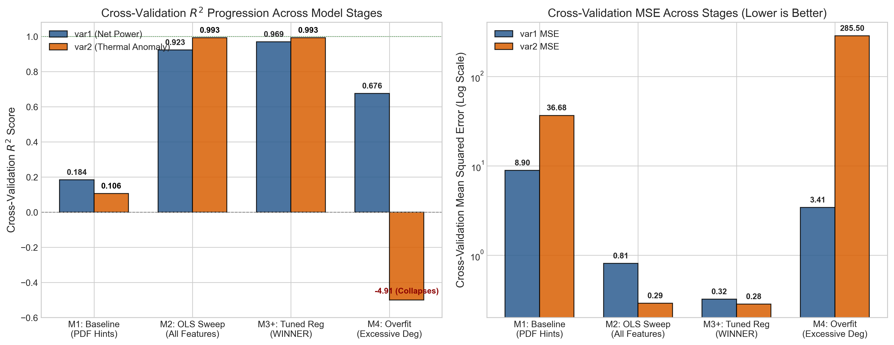
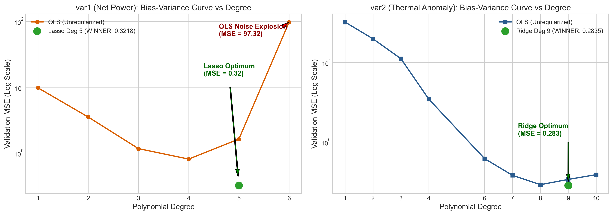
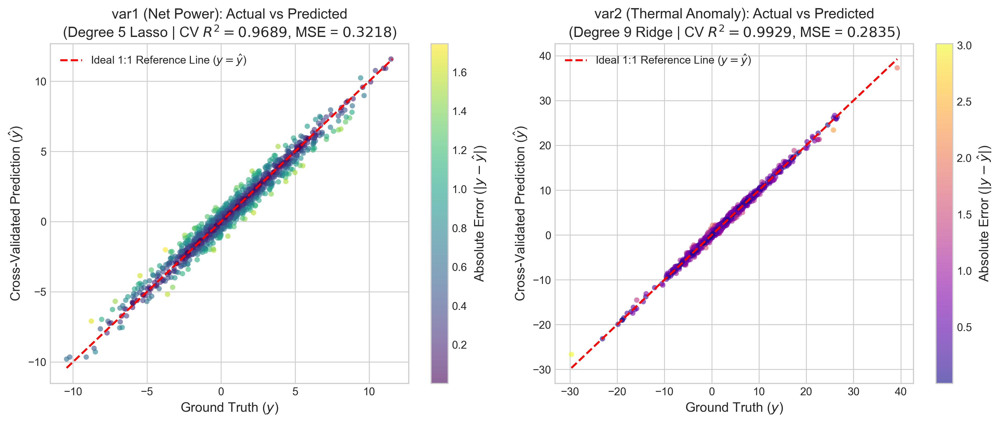
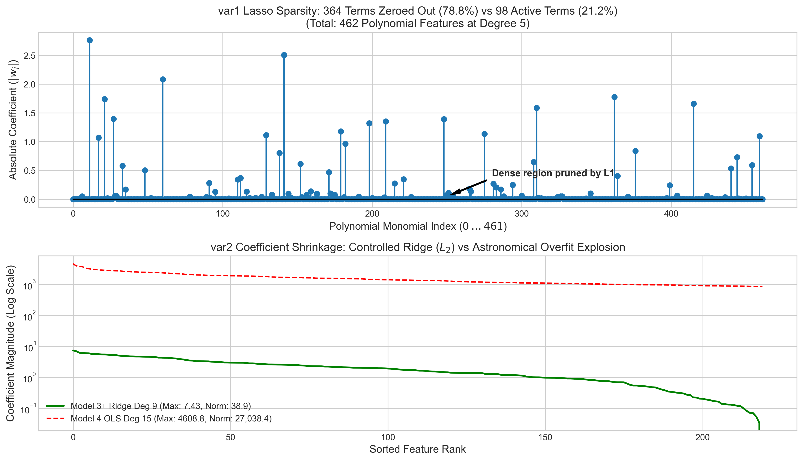
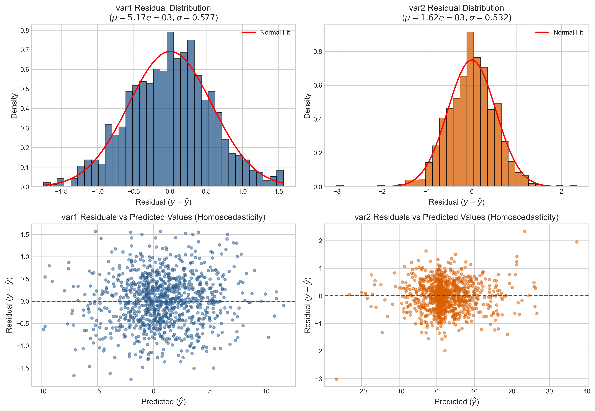

# Machine Learning Assignment 1: Polynomial Regression
**Student:** Ayush Patel  
**Roll Number:** BT2024054  
**Course:** Machine Learning  

---

## Overview

This repository contains my implementation for ML Assignment 1 on Polynomial Regression. I was assigned two specific datasets for roll number **BT2024054**:

1. **`var1` (Net Power Score):** Predicting steam turbine power output from 6 operational parameters.
2. **`var2` (Thermal Anomaly Score):** Predicting subsurface geothermal temperatures from 3 spatial coordinates $(x_1, x_2, x_3)$.

The goal was to build accurate polynomial regression models without using non-polynomial methods like neural networks or decision trees. Rather than sticking to the initial hints in the assignment PDF (which turned out to underfit heavily on my data), I stepped through 4 stages of model development to find the best configuration using 5-fold cross-validation.

---

## Model Progression & Results

Here is a summary of how the models evolved from the naive starting point to the final tuned models:

| Stage | Model & Setup | var1 CV $R^2$ | var1 CV MSE | var2 CV $R^2$ | var2 CV MSE | What I Learned |
|:---|:---|:---:|:---:|:---:|:---:|:---|
| **Model 1: Baseline** (`model1_baseline.py`) | Following PDF hints directly (OLS)<br>• var1: degree 3, features $x_1-x_3$<br>• var2: degree 4, feature $x_1$ only | 0.1838 | 8.9044 | 0.1058 | 36.678 | Severe underfitting. Discarding input features threw away critical signal. |
| **Model 2: OLS Sweep** (`model2_ols_sweep.py`) | Unregularized OLS with all features<br>• var1: degree 4, all 6 features<br>• var2: degree 8, all 3 features | 0.9230 | 0.8081 | 0.9927 | 0.2896 | Huge jump in performance. Confirmed that all features are active. Hit a limit at higher degrees without regularization. |
| **Model 3: Regularized** (`model3_regularized.py`) | Adding Lasso & Ridge<br>• var1: degree 5 + Lasso ($\alpha \approx 0.0033$)<br>• var2: degree 9 + Ridge ($\alpha \approx 0.0066$) | 0.9686 | 0.3335 | 0.9929 | 0.2835 | Regularization allowed higher degrees without blowing up variance. |
| **Model 3+ (Final)** (`train_predict.py`) | Fine-tuned regularizers<br>• var1: degree 5 + Lasso ($\alpha = 0.00348$)<br>• var2: degree 9 + Ridge ($\alpha = 0.00665$) | **0.9689** | **0.3218** | **0.9929** | **0.2835** | **Final submission model.** Lowest validation MSE and best balance between fit and complexity. |
| **Model 4: Overfit Demo** (`model4_overfit.py`) | Extreme degrees with no regularization<br>• var1: degree 8 OLS (3,003 terms)<br>• var2: degree 15 OLS (816 terms) | 0.6757<br>*(Train: 0.9999)* | 3.414<br>*(Train: 0.0006)* | -4.906<br>*(Train: 0.9987)* | 285.50<br>*(Train: 0.052)* | Classic overfitting. Memorized the training data but failed completely on validation splits. |

---

## Why I Chose These Final Models

### 1. Why the PDF hints didn't work
The PDF suggested starting with degree 3 on $x_1-x_3$ for `var1`, and degree 4 on $x_1$ for `var2`. When I ran that, the validation $R^2$ was only ~0.18 and ~0.10. That made sense once I looked closer at the problem:
- For the turbine (`var1`), leaving out $x_4, x_5, x_6$ meant ignoring blade pitch and steam pressures. You can't predict turbine power accurately if you drop half the system's inputs.
- For the geological reservoir (`var2`), temperature varies across 3D space $(x, y, z)$. Dropping two dimensions makes accurate mapping impossible.
Since each student's dataset was generated independently, trusting cross-validation on the actual data was much more reliable than following generic suggestions.

### 2. Why Lasso ($L_1$) on `var1`
Expanding 6 features to degree 5 creates 462 polynomial terms. In a real turbine, variables interact, but not every possible 4th- or 5th-order cross product is meaningful. 
Lasso penalizes absolute coefficient values ($\alpha \sum |w_j|$), which drives unnecessary coefficients exactly to zero. When I inspected the fitted model, Lasso pruned **364 out of 462 terms (78.8%)**, keeping only 98 active terms. Ridge keeps all 462 terms alive and only achieved $R^2 = 0.952$, whereas Lasso reached **0.9689**.

### 3. Why Ridge ($L_2$) on `var2`
For `var2`, we have 3 spatial coordinates expanded to degree 9 (220 terms). Underground temperature fields are continuous and smooth (following heat conduction physics). Because temperature gradients change gradually across all three axes, zeroing out terms (like Lasso does) hurts spatial smoothness. Ridge shrinks the coefficients without setting them to zero, keeping the total weight norm at 38.9 and avoiding the huge coefficient spikes seen in unregularized OLS. This gave an $R^2$ of **0.9929** with very low error ($\text{MSE} = 0.2835$).

### 4. What Model 4 showed
To see what happens when polynomial degree goes too high without regularization, I tested degree 8 on `var1` and degree 15 on `var2`. Training $R^2$ reached almost 1.0, but on validation data, `var2` MSE exploded to **285.5** and $R^2$ went down to **-4.906**. The unconstrained weights blew up into the thousands ($\pm 4,600$), creating wild oscillations between points (Runge's phenomenon). This confirmed that Model 3 sits right in the sweet spot.

---

## Visualizations

I generated 5 diagnostic plots to illustrate the experimental progression:

1. **Model Comparison Across Stages:** Shows $R^2$ and MSE progression across M1, M2, M3+, and M4.  
   

2. **Bias-Variance Curves:** Demonstrates validation MSE vs degree, showing the U-shaped curve where OLS begins to overfit and where regularization stabilizes the error.  
   

3. **Actual vs. Predicted:** Out-of-fold cross-validation predictions plotted against ground truth along the 1:1 line ($y = \hat{y}$).  
   

4. **Sparsity & Coefficient Shrinkage:** Shows the 364 terms zeroed out by Lasso on `var1`, and compares Ridge weight shrinkage against the blown-up OLS weights on `var2`.  
   

5. **Residual Diagnostics:** Histograms and residual-vs-fitted plots confirming zero-mean, normally distributed errors without obvious heteroscedasticity.  
   

---

## Project Structure

```
ML_ASSIGNMENT/
├── BT2024054/
│   ├── BT2024054_train_var1.csv          # Training data for var1 (1000 rows)
│   ├── BT2024054_test_var1.csv           # Test inputs for var1 (1000 rows)
│   ├── BT2024054_train_var2.csv          # Training data for var2 (1000 rows)
│   ├── BT2024054_test_var2.csv           # Test inputs for var2 (1000 rows)
│   ├── BT2024054_pred_var1.csv           # Final submission predictions (var1)
│   └── BT2024054_pred_var2.csv           # Final submission predictions (var2)
├── train_predict.py                      # Main script for final models & predictions
├── generate_plots.py                     # Generates all figures in ./figures/
├── model1_baseline.py                    # Stage 1: Baseline model (PDF hints)
├── model2_ols_sweep.py                   # Stage 2: Data-driven OLS with all features
├── model3_regularized.py                 # Stage 3: Regularized models (Lasso & Ridge)
├── model4_overfit.py                     # Stage 4: Overfitting demonstration
├── figures/                              # Saved diagnostic plots (300 DPI)
├── REPORT.md                             # Full written report
└── README.md                             # Project overview
```

---

## How to Run the Code

Install dependencies:
```bash
pip install numpy pandas scikit-learn matplotlib
```

Generate final predictions (`BT2024054_pred_var1.csv` and `BT2024054_pred_var2.csv`):
```bash
python3 train_predict.py
```

Recreate all figures in `./figures/`:
```bash
python3 generate_plots.py
```

Run each model stage individually:
```bash
python3 model1_baseline.py       # Stage 1
python3 model2_ols_sweep.py      # Stage 2
python3 model3_regularized.py    # Stage 3
python3 model4_overfit.py        # Stage 4
```

---

## Prediction File Checks

Both final prediction files were checked before submission:
- Correct filename: `BT2024054_pred_var1.csv` and `BT2024054_pred_var2.csv`.
- Exactly 1,000 prediction rows matching the test sets.
- Single column named `y` matching `sample_submission.csv`.
- No NaN, null, or infinite values.
- Means and ranges are consistent with the training distributions (`var1` pred mean ~1.28 vs train mean ~0.76; `var2` pred mean ~1.88 vs train mean ~2.40).
